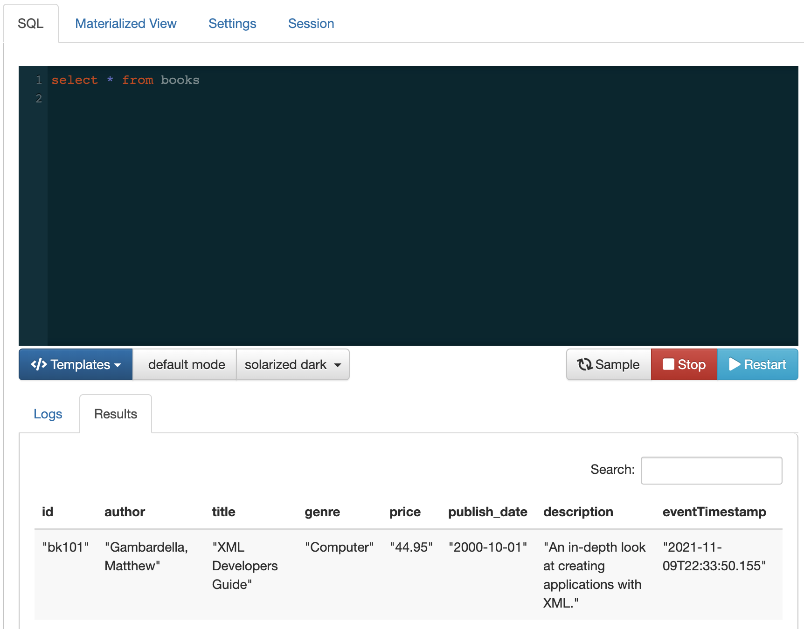

= SQL Stream Builder examples

==  Processing XML

At the time of this writing SSB doesn't yet have native support to XML data.
In this example we look at how we can make use of transformations to parse XML data and convert it into JSON.

=== The source data

In this example we will be reading data from a Kafka topic. Each message in this topic contains an XML data with the following format:

[source,xml]
----
<book id="bk101">
  <author>Gambardella, Matthew</author>
  <title>XML Developers Guide</title>
  <genre>Computer</genre>
  <price>44.95</price>
  <publish_date>2000-10-01</publish_date>
  <description>An in-depth look at creating applications with XML.</description>
</book>
----

=== Converting from XML to JSON

To convert the data to JSON we will use the `org.json.XML.toJSONObject()` method. This method takes an XML string like the one above and converts it to an equivalent JSON with the following structure:

[source,json]
----
{
  "book": {
    "author": "Gambardella, Matthew",
    "price": "44.95",
    "genre": "Computer",
    "description": "An in-depth look at creating applications with XML.",
    "id": "bk101",
    "title": "XML Developers Guide",
    "publish_date": "2000-10-01"
  }
}
----

=== Dependencies

Unfortunately, the JAR that contains the `org.json.XML` class is not part of the default dependencies for SSB.
We can find it in a CDP deployment under `/opt/cloudera/parcels/CDH/jars/json-20070829.jar`, but this is a location that SSB doesn't source from.
To make this JAR available to SSB we need to copy it to a different location

Also, besides copying the JAR we need to change its name.
The `hive-exec` JAR used by SSB has different versions of some of the `json` classes we need to use and can conflict with them.
To make sure that we can use `org.json.XML` without problems we need to ensure the JAR file comes first (alphabetically) in the list of JARs used by SSB.

Because of this, we will create a copy of the JAR with the name `aardvark-json-20070829.jar`.
The actual name doesn't matter much, as long as it is the first JAR to be listed, alphabetically.

The directory where we will copy the JAR file can be found in the SQL Stream Builder configuration in Cloudera Manager in the property shown below and it is, by default, `/usr/share/flink-connectors`.

Execute the following commands to prepare the JAR dependency:

[source,shell]
----
sudo mkdir /usr/share/flink-connectors
sudo chmod 755 /usr/share/flink-connectors
sudo cp /opt/cloudera/parcels/CDH/jars/json-20070829.jar /usr/share/flink-connectors/aardvark-json-20070829.jar
sudo chmod 644 /usr/share/flink-connectors/aardvark-json-20070829.jar
----

After copying the JAR, restart the SQL Stream Builder service in Cloudera Manager.

=== Creating the SSB table

We are assuming the Kafka topic already exists and it is named `books`.

In SSB, create an *Apache Kafka* table with the following properties:

[%autowidth,cols="1,1a"]
|===
|*Table name*|`books`
|*Kafka Cluster*|<your Kafka cluster>
|*Topic Name*|`books`
|*Data Format*|`JSON`

|*Schema:
|
[source,json]
----
{
    "namespace": "com.cloudera.exampleschema",
    "type": "record",
    "name": "Book",
    "fields": [
        { "name": "id", "type": "string" },
        { "name": "author", "type": "string" },
        { "name": "title", "type": "string" },
        { "name": "genre", "type": "string" },
        { "name": "price", "type": "string" },
        { "name": "publish_date", "type": "string" },
        { "name": "description", "type": "string" }
    ]
}
----

|Transformation:
|
[source,javascript]
----
var XML = Java.type("org.json.XML");
var doc = XML.toJSONObject(record.value);
doc.get("book").toString();
----

|===

Alternatively, you can use the following DDL instead to create the table:

[source,sql]
----
CREATE TABLE books (
  id STRING,
  author STRING,
  title STRING,
  genre STRING,
  price STRING,
  publish_date STRING,
  description STRING,
  eventTimestamp TIMESTAMP(3) METADATA FROM 'timestamp',
  WATERMARK FOR eventTimestamp AS eventTimestamp - INTERVAL '3' SECOND
) COMMENT 'books'
WITH (
  'connector' = 'kafka',
  'format' = 'json',
  'topic' = 'books',
  'properties.bootstrap.servers' = '<kafka_broker_host>:<kafka_broker_port>',
  'properties.auto.offset.reset' = 'earliest',
  'properties.request.timeout.ms' = '120000',
  'properties.transaction.timeout.ms' = '900000',
  'scan.transform.js.code' = 'var XML = Java.type("org.json.XML"); var doc = XML.toJSONObject(record.value); doc.get("book").toString();',
  'scan.startup.mode' = 'earliest-offset'
)
----

=== Querying

Once the table is created you can simply start querying it. The table transformation will take care of converting the data to JSON so that SSB can correctly process it:

